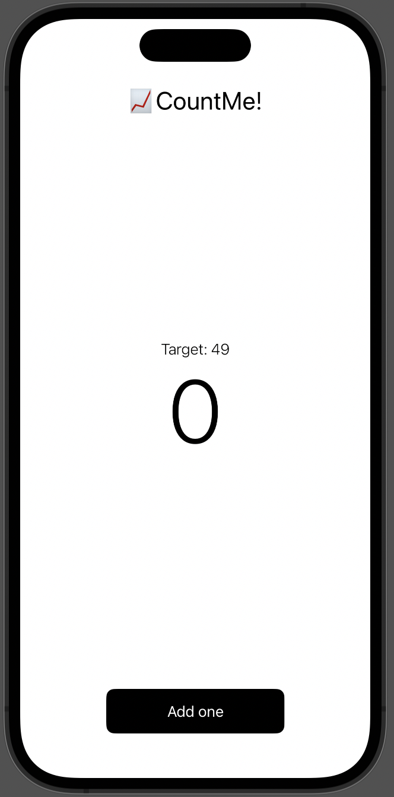
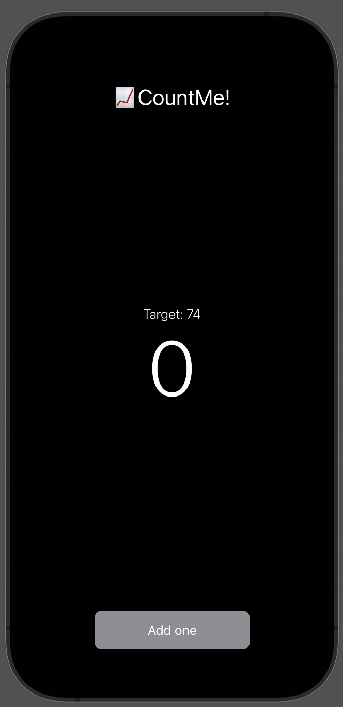

# CountMe! 📈

A simple yet elegant counter app built with SwiftUI that helps you keep track of your counts. The app features a clean, modern interface with support for both light and dark modes.

## Features

- 🎯 Random target score generation
- 🔄 Automatic reset when target is reached
- 🌓 Beautiful light and dark mode support
- 📱 Optimized for both iPhone and iPad
- 🎨 Modern SwiftUI design

## Screenshots

### Light Mode


### Dark Mode


## Requirements

- iOS 17.6+
- Xcode 16.3+
- Swift 5.0+

## Installation

1. Clone the repository
```bash
git clone https://github.com/iOSYahoCode/CountMe.git
```

2. Open `Hello Swift UI.xcodeproj` in Xcode

3. Build and run the project (⌘R)

## Architecture

The app follows the MVVM (Model-View-ViewModel) architecture pattern:

- **Model**: `CounterModel` - Handles the data structure
- **ViewModel**: `CounterViewModel` - Manages the business logic
- **View**: `CounterView` - Handles the UI presentation

## License

This project is available under the MIT license. See the LICENSE file for more info.

## Author

Yaroslaw Homziak
- GitHub: [@iOSYahoCode](https://github.com/iOSYahoCode) 
